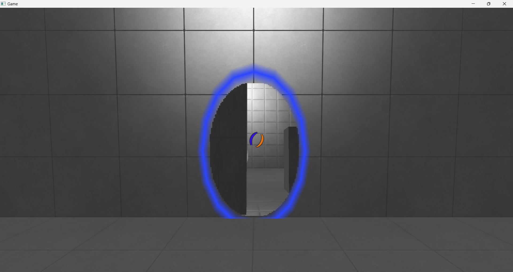

# p2

# 目次

  + [p2](#anchor1)
  + [目次](#anchor2)
  + [操作方法](#anchor3)
  + [制作環境](#anchor4)
  + [作成したコード](#anchor5)
  + [技術紹介](#anchor6)
    + [ポータルの作成方法](#anchor7)
    + [グラフィック](#anchor8)
  
 

# 概要

+ **制作期間**  
    2023年10月～2024年2月

+ **制作人数**  
  1人

+ **ジャンル**  
  アクション・パズル

+ **プレイ人数**  
  1人

+ **対応機種**　 
  Windows 11
  
 

---

# 操作方法

+ Aボタン 
  + ジャンプ
  + 決定
+ Bボタン 
  + 戻る
+ Yボタン 
  + しゃがみ
+ RTボタン 
  + 発射(赤)
+ LTボタン 
  + 発射(青)
+ Lスティック 
  + 移動
+ Rスティック 
  + 回転

 

---

# 制作環境

+ **使用ツール** 
  Visual Studio 2022  
  Visual Studio Code  
  3ds Max 2023  
  Adobe Photoshop 2022  
  Effekseer  
  fork  
  Github

 

+ **使用言語** 
    C++ 
    HLSL 

 

---

# 作成したコード

**作成したコード**

+ PortalEngineプロジェクトの全て
+ Gameプロジェクトの全て

**改造したエンジンコード**

+ CharacterContoller.cpp
  + 天井への当たり判定処理(301行目～)

 

---

# 技術紹介

### **ポータルの作成方法**

+ 設置処理

  まずは、ポータルの設置位置を決めます。 
  プレイヤーの注視点から前方向にレイを飛ばし、衝突した壁の法線に沿ってポータルを設置します。

   

+ ポータル越しのカメラ

  次に、ポータルから見える背景を描画します。

  まず、ポータルの位置にカメラを設置します。 
  このカメラの向きは、プレイヤーからもう一方のポータルに向かうベクトルと同じ方向になります。

  
  

   

  この状態では、プレイヤーが移動したときに奥行き感のない背景が出来上がってしまいます。 
  なので、カメラの位置も考慮します。

  

   

  ポータルの背景というのは、プレイヤーの位置から見える景色を写しているはずです。 
  ですので、カメラの位置は、もう一方のポータルからプレイヤーに向かうベクトルと反対方向の位置になります。

  

   

  a

  

   

  ここまででポータルの挙動を再現できました。 
  しかし、このままではポータルの向きが真反対の場合以外では、カメラが正しい向きになりません。

  

   

  ここで注目するのは、ポータル同士の向きです。
  カメラの位置や向きの計算結果は、回転を考慮していないベクトルになります。

   

  

   

  ですので、予めポータル同士の向きをクォータニオンで保存し、計算時にベクトルに適用することで、向きの異なるポータル同士に対応したカメラになります。

  

   

+ 通過処理

  あとは、通過した際に、もう片方のポータルの位置にワープする処理を作るだけです。 
  しかし、このままでは壁があるので通過することができません。

   

  このゲームでは、ポータルに触れている間、ポータルの当たり判定処理のみを実行することで、ポータルが壁をくり抜いているように表現しました。

 

### **グラフィック**

+ PBR

+ ディファードライティング

+ ライトカリング